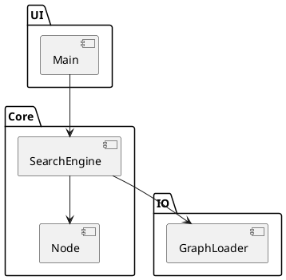

# Manual Técnico – Proyecto IA1_1S2025_P3_G10  
**Grupo 10**

---

## 1. Introducción  
Breve descripción del propósito del sistema, objetivos y contexto académico.

## 2. Guía de instalación  
### 2.1 Requisitos previos  
- Sistema operativo: Windows 10 o superior  
- Python 3.9+  
- Librerías: `numpy`, `matplotlib`, `networkx`  
- Java 11 (si se usan componentes en Java)  

### 2.2 Pasos de instalación  
1. Clonar el repositorio:
   ```
   git clone https://github.com/usuario/proyecto-ia.git
   ```
2. Crear y activar entorno virtual:
   ```
   python -m venv venv
   venv\Scripts\activate
   ```
3. Instalar dependencias:
   ```
   pip install -r requirements.txt
   ```
4. Ejecutar pruebas de humo:
   ```
   pytest
   ```

## 3. Arquitectura del sistema  
### 3.1 Descripción general  
El sistema consta de tres módulos principales:  
- **Interfaz de usuario**: Consola o GUI básica.  
- **Núcleo de búsqueda**: Implementa algoritmos genéricos.  
- **Persistencia**: Lectura/escritura de gráficas o estados desde archivos.  

### 3.2 Diagrama de componentes (PlantUML)  


## 4. Flujo del sistema  
1. El usuario ingresa datos o selecciona un archivo de grafo.  
2. `GraphLoader` parsea entradas y crea la representación interna.  
3. `SearchEngine` recibe grafo y parámetros, selecciona algoritmo.  
4. Se recorre el grafo; se devuelven resultados y se muestran.

## 5. Herramientas utilizadas  
- Python 3.9+  
- PlantUML para diagramas  
- VS Code como IDE  
- Git para control de versiones  
- pytest para pruebas unitarias  

## 6. Algoritmos de búsqueda  
### 6.1 A*  
- **Descripción**: Búsqueda informada con heurística admisible.  
- **Justificación**: Equilibra coste real y estimado, ideal para rutas óptimas en grafos grandes.  

### 6.2 Iterative Deepening A* (IDA*)  
- **Descripción**: Variante de A* que aplica profundidad limitada iterativa.  
- **Justificación**: Usa menos memoria que A*, adecuado para espacios de búsqueda con alta ramificación.  

### 6.3 Búsqueda en anchura (BFS)  
- **Descripción**: Explora niveles completos antes de avanzar.  
- **Justificación**: Garantiza la solución óptima si todos los costes de arista son iguales; sirve como baseline.  

### 6.4 Búsqueda en profundidad (DFS)  
- **Descripción**: Explora una rama hasta el final antes de retroceder.  
- **Justificación**: Útil para detección rápida de una solución cualquiera, pero no garantiza optimalidad ni terminación en ciclos.  

---

