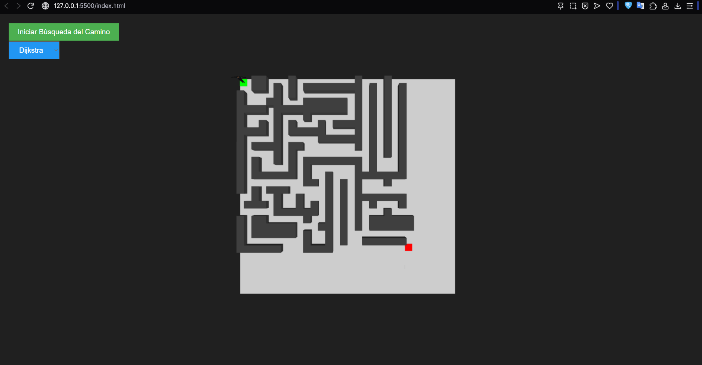
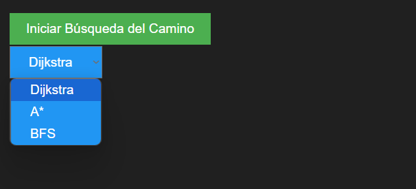

# Manual de Usuario – Proyecto IA1_1S2025_P3_G10  
**Grupo 10**

## 1. Introducción  
Breve descripción de la finalidad del sistema y contexto de uso.

## 2. Requisitos Previos  
- Navegador web moderno (Chrome, Firefox, Edge)  
- Conexión a Internet para cargar dependencias CDN  
- Archivos del proyecto en local (index.html, script.js, style.css, maze.json, robot.fbx)

## 3. Inicio Rápido  
1. Abrir `index.html` en el navegador.  
2. Esperar que se cargue la escena 3D del laberinto y el robot.  
3. Seleccionar algoritmo en el menú desplegable.  
4. Pulsar **Iniciar Búsqueda del Camino**.

## 4. Interfaz de Usuario  
- Botón **Iniciar Búsqueda del Camino**: lanza la animación de búsqueda.  
- Selector de algoritmo: elige entre Dijkstra, A* o BFS.  
- Vista 3D: muestra el laberinto, el robot y el camino coloreado en azul.

## 5. Capturas de Pantalla  
  
*Figura 1: Selector de algoritmo y botón de inicio.*  

*Figura 2: El robot recorriendo el laberinto siguiendo el camino encontrado.*

## 6. Uso Detallado  
1. Ajustar la posición de la cámara (si se desea) modificando `camera.position` en `script.js`.  
2. Cambiar colores de materiales editando `style.css` o las constantes en `script.js`.  
3. Para usar un laberinto distinto, reemplazar `maze.json` y actualizar dimensiones (`ancho`, `alto`).

## 7. Resolución de Problemas Comunes  
- Si no aparece nada:  
  - Verificar consola del navegador para errores de carga.  
  - Asegurarse de que `three.min.js` y `FBXLoader.js` se carguen sin bloqueos CORS.  
- Camino no encontrado:  
  - Revisar que `inicio` y `fin` en `maze.json` sean válidos (no estén en paredes).  
- Robot no se mueve:  
  - Confirmar que `robot.fbx` esté en la misma carpeta y con animaciones nombradas correctamente.